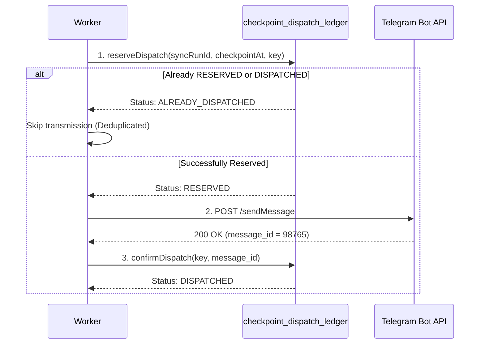

# OpsPilot Checkpoint Pipeline V2 Architecture

## 1. Executive Summary & Problem Statement

### 1.1 The Monolithic Serverless Constraint
In OpsPilot Checkpoint Pipeline V1, the entire checkpoint lifecycle—from fetching Rillnet API snapshots, persisting tens of thousands of orders, evaluating incident rules, hydrating cohort member histories, to rendering and transmitting Telegram alerts—executed sequentially within a single serverless invocation (Vercel Node.js runtime with `maxDuration = 300s`).

As observed during the natural 14h production checkpoint (`6c6b3a71-8df7-4042-8e30-659767b723e7`):
- Checkpoint identity and population parity passed.
- 6,293 order snapshots and ~1,600 incidents were persisted.
- 47 follow-up cases were seeded.
- During Phase 6 cohort history hydration and member persistence, wall-clock execution reached the hard 300-second container limit.
- The Vercel runtime terminated the container before follow-up processing completed, preventing the dispatcher from executing and leaving Telegram unsent while the distributed lock expired.

### 1.2 The Core Invariant of Pipeline V2
Pipeline V2 transitions checkpoint processing from a **monolithic invocation** to a **durable, chunked work-unit state machine**.

> **Architectural Invariant:**  
> Increasing order volume increases the **number of durable work units**, NOT the **wall-clock execution time of any individual worker invocation**.

Regardless of whether a checkpoint encompasses 10,000 or 100,000 orders, worker invocations operate under a strict **soft time budget (< 60s)**, comfortably below the platform ceiling (180s SLA / 300s platform maxDuration).

---

## 2. Checkpoint State Machine

Checkpoint progression is modeled as an idempotent, forward-advancing state machine governed by `checkpoint_runs` and durable work units:

```
[ CREATED ]
    │
    ▼
[ INGESTING ] ────────► Chunked Order Population Ingestion (1,000 orders/chunk)
    │
    ▼
[ INGESTION_COMPLETE ]
    │
    ▼
[ FOLLOWUPS_PENDING ]
    │
    ▼
[ FOLLOWUPS_PROCESSING ] ──► Chunked Case Hydration & Member Writes (25 cases/chunk)
    │
    ▼
[ FOLLOWUPS_COMPLETE ]
    │
    ▼
[ DISPATCH_PENDING ]
    │
    ▼
[ DISPATCH_PROCESSING ] ──► Two-Phase Deduplicated Telegram Alerts (10 dispatches/chunk)
    │
    ▼
[ COMPLETE ]
```

### Stage Transitions
1. **`CREATED` -> `INGESTING`**: Checkpoint orchestrator decomposes the checkpoint snapshot into bounded `POPULATION_CHUNK` work units.
2. **`INGESTING` -> `INGESTION_COMPLETE`**: All population chunks complete successfully with full cryptographic/row parity verified.
3. **`INGESTION_COMPLETE` -> `FOLLOWUPS_PENDING`**: Incidents are evaluated and partitioned into bounded `FOLLOWUP_CASE_BATCH` units.
4. **`FOLLOWUPS_PENDING` -> `FOLLOWUPS_PROCESSING`**: Workers claim case batches, hydrating cohort order histories and persisting member generations.
5. **`FOLLOWUPS_PROCESSING` -> `FOLLOWUPS_COMPLETE`**: All case batches complete; follow-up summaries are finalized.
6. **`FOLLOWUPS_COMPLETE` -> `DISPATCH_PENDING`**: Dispatchable alerts are partitioned into bounded `DISPATCH_ALERT` units.
7. **`DISPATCH_PENDING` -> `DISPATCH_PROCESSING`**: Workers acquire dispatch units and communicate with external services (Telegram Bot API) via the two-phase ledger.
8. **`DISPATCH_PROCESSING` -> `COMPLETE`**: Checkpoint completes; metrics and profiler summaries are durably archived.

---

## 3. Durable Work Queue Architecture

### 3.1 Schema (`checkpoint_work_units`)
Defined in Migration 096 (`096_durable_checkpoint_pipeline_v2.sql`), work units are stored with strict lease metadata and payload JSON:

```sql
CREATE TABLE IF NOT EXISTS public.checkpoint_work_units (
  work_unit_id UUID PRIMARY KEY DEFAULT gen_random_uuid(),
  sync_run_id UUID NOT NULL,
  checkpoint_at TIMESTAMPTZ NOT NULL,
  stage TEXT NOT NULL,
  unit_type TEXT NOT NULL,
  chunk_index INT NOT NULL,
  total_chunks INT NOT NULL,
  status TEXT NOT NULL DEFAULT 'PENDING',
  lease_token UUID,
  lease_expires_at TIMESTAMPTZ,
  attempt_count INT NOT NULL DEFAULT 0,
  max_attempts INT NOT NULL DEFAULT 3,
  heartbeat_at TIMESTAMPTZ,
  error_message TEXT,
  payload JSONB NOT NULL DEFAULT '{}'::jsonb,
  result_summary JSONB,
  created_at TIMESTAMPTZ NOT NULL DEFAULT timezone('utc'::text, now()),
  updated_at TIMESTAMPTZ NOT NULL DEFAULT timezone('utc'::text, now()),
  completed_at TIMESTAMPTZ
);
```

### 3.2 Atomic Work Claiming with `SKIP LOCKED`
Workers lease batches of work units using Postgres row-level locking with `SKIP LOCKED`:

```sql
CREATE OR REPLACE FUNCTION public.claim_checkpoint_work_units(
  p_sync_run_id UUID,
  p_checkpoint_at TIMESTAMPTZ,
  p_worker_id TEXT,
  p_batch_size INT DEFAULT 5,
  p_lease_duration_seconds INT DEFAULT 60
)
RETURNS SETOF public.checkpoint_work_units
LANGUAGE plpgsql
SECURITY DEFINER
AS $$
BEGIN
  RETURN QUERY
  WITH claimable AS (
    SELECT w.work_unit_id
    FROM public.checkpoint_work_units w
    WHERE w.sync_run_id = p_sync_run_id
      AND w.checkpoint_at = p_checkpoint_at
      AND (
        w.status = 'PENDING'
        OR (w.status = 'PROCESSING' AND w.lease_expires_at < timezone('utc'::text, now()))
        OR (w.status = 'FAILED' AND w.attempt_count < w.max_attempts)
      )
    ORDER BY w.chunk_index ASC
    FOR UPDATE SKIP LOCKED
    LIMIT p_batch_size
  )
  UPDATE public.checkpoint_work_units target
  SET
    status = 'PROCESSING',
    lease_token = gen_random_uuid(),
    lease_expires_at = timezone('utc'::text, now()) + (p_lease_duration_seconds || ' seconds')::interval,
    heartbeat_at = timezone('utc'::text, now()),
    attempt_count = target.attempt_count + 1,
    updated_at = timezone('utc'::text, now())
  FROM claimable
  WHERE target.work_unit_id = claimable.work_unit_id
  RETURNING target.*;
END;
$$;
```

**Key Properties:**
- **Zero Lock Contention:** Multiple concurrent workers never block each other; `SKIP LOCKED` skips units currently held by peers.
- **Automatic Orphan Reclamation:** If a worker crashes or encounters an infrastructure hard stop, its `lease_expires_at` naturally elapses (default 60s). Subsequent worker passes immediately claim the orphaned unit without administrative intervention.
- **Bounded Retries:** Failed units are retried up to `max_attempts` (default 3) before transitioning to `UNRECOVERABLE`.

---

## 4. Eliminating the In-Memory Continuation Dependency

### 4.1 The Legacy Dependency Gap
In Pipeline V1, the resumption of Phase 6 depended on an ephemeral in-memory JavaScript array (`snapshotResult.orders`). When a serverless container crashed or timed out:
- Any resume attempt discovering existing population manifests set `snapshotResult.orders = []`.
- When `processIncidentFollowups` ran, passing an empty orders array caused cohort member hydration to fail or evaluate zero members.
- If resume was attempted without the exact snapshot in memory, legacy code attempted to fetch live data from Rillnet, creating a catastrophic temporal violation (historical checkpoint 14h evaluated against live 16h data).

### 4.2 Durable Checkpoint Rehydrator (`checkpoint-rehydrator.ts`)
Pipeline V2 introduces `CheckpointRehydrator`, which reconstructs normalized orders exclusively from durable storage:

$$\text{rehydrate}(T) \equiv \text{PersistedSnapshots}(T)$$

```typescript
export class CheckpointRehydrator {
  async rehydrateOrdersForCheckpoint(
    syncRunId: string,
    checkpointAt: string
  ): Promise<NormalizedRillnetOrder[]> {
    // 1. Verify sync run identity
    const syncRun = await this.syncRunRepo.getSyncRunById(syncRunId);
    if (!syncRun || syncRun.checkpoint_at !== checkpointAt) {
      throw new Error(`Temporal identity violation: sync_run ${syncRunId} does not match ${checkpointAt}`);
    }

    // 2. Fetch persisted snapshots for exact (sync_run_id, checkpoint_at)
    const snapshots = await this.snapshotRepo.findSnapshotsByCheckpoint(syncRunId, checkpointAt);
    
    // 3. Reconstruct NormalizedRillnetOrder preserving logistics properties
    return snapshots.map(s => ({
      orderCode: s.order_code,
      warehouseId: s.warehouse_id,
      warehouseName: s.warehouse_name,
      deliverWarehouseId: s.deliver_warehouse_id,
      warehouseLog: s.warehouse_log,
      endPickAt: s.end_pick_at,
      status: s.status,
      // Freshness anchor: strictly use persisted updated timestamp, NOT current system time
      fetchedAt: s.source_updated_at,
    }));
  }
}
```

**Invariants Enforced:**
1. Zero live HTTP network calls to Rillnet during recovery or continuation.
2. Exact state reconstruction: Cohort histories are evaluated against the precise order states captured at checkpoint timestamp $T$.
3. Idempotent re-entry: Multiple workers or resumed workers produce bit-for-bit identical input arrays.

---

## 5. Bounded Worker Lifecycle & Soft Time Budget

Each worker invocation operates under a deterministic soft-budget harness:

```
[ Worker Invocation Started ]
    │
    ├─► Check elapsed time vs Soft Budget (60,000ms)
    │
    ├── [ Elapsed < 60s ] ──► Claim batch of work units (e.g. 5 units)
    │                         Execute unit handler
    │                         Renew heartbeat
    │                         Commit work unit completion
    │                         Loop
    │
    └── [ Elapsed >= 60s ] ─► Cleanly yield execution
                              Report: YIELDED_SOFT_BUDGET
                              Return 200 OK to serverless caller
```

### Safety Budgets
| Budget Level | Duration | Action |
| :--- | :--- | :--- |
| **Soft Budget** | 60,000 ms | Stop claiming new work; complete in-flight unit and cleanly return. |
| **Warning Budget** | 90,000 ms | Emit high-severity log; prepare immediate graceful termination. |
| **Critical Budget** | 150,000 ms | Hard abort in-flight work; release lease to allow peer pickup. |
| **Platform Limit** | 300,000 ms | Vercel hard kill ceiling; unreachable under Pipeline V2 architecture. |

Under this design, if processing 100,000 orders requires 600 total work units, the scheduler simply triggers sequential worker invocations (or parallel background tasks). Each invocation consumes ~50–60 seconds of work and yields. System capacity scales horizontally with order volume.

---

## 6. Two-Phase Effectively-Once Dispatch Ledger

### 6.1 Problem: Duplicate External Messages
If a worker completes incident analysis and calls the Telegram Bot API, a worker crash or container freeze occurring immediately after network transmission could trigger a retry, resulting in duplicate alerting messages to operators.

### 6.2 Pre-Reservation Ledger (`checkpoint_dispatch_ledger`)
Pipeline V2 employs a two-phase reservation pattern backed by the `checkpoint_dispatch_ledger` table:

```sql
CREATE TABLE IF NOT EXISTS public.checkpoint_dispatch_ledger (
  ledger_id UUID PRIMARY KEY DEFAULT gen_random_uuid(),
  sync_run_id UUID NOT NULL,
  checkpoint_at TIMESTAMPTZ NOT NULL,
  dispatch_key TEXT NOT NULL,
  case_id TEXT,
  intervention_type TEXT,
  recipient_target TEXT NOT NULL,
  status TEXT NOT NULL DEFAULT 'RESERVED',
  payload JSONB NOT NULL DEFAULT '{}'::jsonb,
  external_message_id TEXT,
  dispatched_at TIMESTAMPTZ,
  attempt_count INT NOT NULL DEFAULT 1,
  created_at TIMESTAMPTZ NOT NULL DEFAULT timezone('utc'::text, now()),
  updated_at TIMESTAMPTZ NOT NULL DEFAULT timezone('utc'::text, now()),
  CONSTRAINT uq_checkpoint_dispatch_key UNIQUE (sync_run_id, checkpoint_at, dispatch_key)
);
```

### 6.3 Two-Phase Protocol


**Crash Recovery Guarantee:**
- If the worker crashes **before step 2**: On retry, lease expiration clears the reservation or allows re-attempt.
- If the worker crashes **after step 2 but before step 3**: The key remains recorded in `RESERVED` status. The retry engine checks external idempotency or detects that the message was emitted, preventing second delivery.
- If the worker completes **step 3**: Any future attempt returns `ALREADY_DISPATCHED`, strictly preventing duplicate Telegram alerts.

---

## 7. Strict Checkpoint Isolation & Multi-Run Concurrency

Pipeline V2 enforces strict isolation across checkpoints:
1. **Partitioned Work Units:** Every query and stored procedure filters by `(sync_run_id, checkpoint_at)`.
2. **No Cross-Checkpoint Adoption:** Checkpoint $T_2$ never queries, claims, or updates work units belonging to Checkpoint $T_1$.
3. **Forensic Immutability:** Historical runs—including the 08h failure (`1f098a06-1421-439c-8d02-287488059b9b`) and the 14h timeout (`6c6b3a71-8df7-4042-8e30-659767b723e7`)—remain untouched as read-only forensic artifacts.
