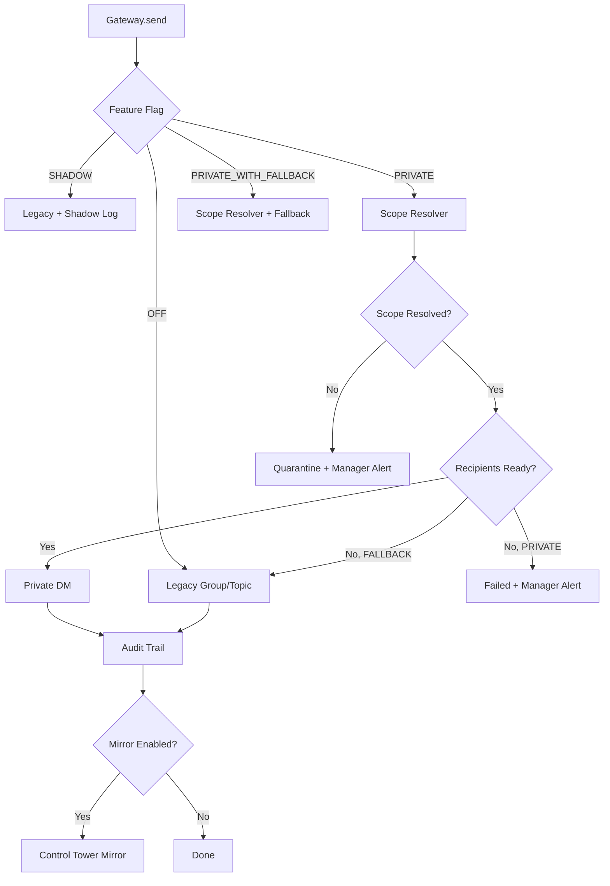

# OpsPilot Telegram Routing Architecture

## 1. Current vs New Architecture

### Current Architecture (Legacy)
```
Incident / Follow-up
  → buildReminderMessage()
  → TelegramClient.sendToChat(groupChatId, {messageThreadId})
  → Telegram Group / Province Topic
```

All employees in the group can see all messages. No per-user authorization.

### New Architecture
```
Incident / Follow-up
  → NotificationGateway.send({eventType, incidentId, message, audience})
  → Feature Flag → Routing Mode Decision
  
  ┌─── OFF (Legacy) ──────→ Group/Topic (unchanged)
  ├─── SHADOW ─────────────→ Group/Topic + shadow log
  ├─── PRIVATE ────────────→ RBAC Scope Resolver
  │                           → Authorized Employee Private DM
  │                           + Manager Mirror → Control Tower Topic
  │                           + Message Audit
  └─── PRIVATE_WITH_FALLBACK → Private DM (or Group/Topic if not ready)
```

### Key Principle
> **Business Brain stays FROZEN.**
> Only the delivery layer changes — "who gets what, through which channel."

---

## 2. User / Role / Scope Model

### Roles
| Role | Description |
|------|------------|
| `EMPLOYEE` | Receives incidents in authorized scope via private DM |
| `LEAD` | Province-level visibility, can manage scope within province |
| `MANAGER` | Region-level visibility, observes all via Control Tower |
| `ADMIN` | System-wide access |

### Scope Types
| Scope | Example | Meaning |
|-------|---------|---------|
| `WAREHOUSE` | `Đông Cuông` | Receives incidents for this warehouse only |
| `PROVINCE` | `Yên Bái` | Receives all incidents in the province |
| `REGION` | `Miền Bắc 3` | Region-wide visibility |
| `ALL` | `*` | System-wide |

### Authorization Flow
```
Incident metadata (warehouse, province)
  → ScopeResolver.resolveAuthorizedRecipients()
  → Query telegram_user_scopes WHERE scope matches
  → DENY BY DEFAULT (no scope = no delivery)
  → If unresolvable → quarantine + manager alert
```

---

## 3. Private Onboarding

### States
| State | Meaning |
|-------|---------|
| `PRIVATE_READY` | User has /start-ed bot, can receive DMs |
| `PRIVATE_NOT_STARTED` | User enrolled but hasn't started bot |
| `DISABLED` | Private delivery disabled for user |
| `BLOCKED` | User blocked the bot |
| `UNKNOWN` | Initial state |

### Flow
```
1. Employee /join in group → PENDING member
2. Manager assigns scope → ACTIVE member
3. Employee /start OpsPilot bot → PRIVATE_READY
4. Gateway can now send DMs
```

### Fallback Policy
- `PRIVATE_READY` → send DM
- `PRIVATE_NOT_STARTED` → fallback to group/topic (if PRIVATE_WITH_FALLBACK)
- `BLOCKED` → manager attention alert + fallback
- `UNKNOWN` → fallback + log

---

## 4. Notification Routing

### Gateway API
```typescript
gateway.send({
  eventType: "FIRST_PUSH",
  incidentId: "uuid",
  incidentKey: "INC-xxx",
  message: "formatted message text",
  audience: {
    province: "Yên Bái",
    warehouse: "Đông Cuông",
    chatId: "group chat id",        // for legacy fallback
    messageThreadId: 123,            // for legacy topic
    recipientMemberIds: ["uuid1"],   // for private routing
  },
  options: {
    parseMode: "HTML",
    idempotencyKey: "telegram-followup:case-id:FIRST",
  },
});
```

### Routing Decision Flow


---

## 5. Manager Control Tower

### Purpose
Transform existing Telegram group into an observation dashboard for managers.

### Message Types

**🔵 OUTGOING** — what was sent, to whom, when
```
🔵 OUTGOING
Đã gửi → Nguyễn Văn A

Kho: Đông Cuông
Case: INC-xxx

NHẮC LẦN 1
[message preview]

Sent: 17:14
Status: ✅ SUCCESS
```

**🟢 REPLY** — employee response
```
🟢 REPLY
Nguyễn Văn A → OpsPilot

Case: INC-xxx
Kho: Đông Cuông

"Chưa đến COT xuất, 20h sẽ chuyển"

Received: 17:45
```

**🤖 ANALYSIS** — AI classification
```
🤖 OPSPILOT ANALYSIS

Classification: VALID_EXPLANATION
Cause: Chưa đến COT xuất
Commitment: 20:00
Next check: 20:30
Action: NO_ESCALATION
```

**⚠️ NEEDS ATTENTION** — urgent cases
```
⏰ NEEDS ATTENTION

Reason: NO RESPONSE AFTER SLA
Case: INC-xxx
Kho: Đông Cuông

No reply after 2 reminders.
```

---

## 6. Audit Model

### message_deliveries
Records every outbound delivery attempt:
- Intended destination, actual destination
- Exact content, Telegram API result
- Routing mode and reason
- Idempotency key for deduplication

### conversation_events
Records every inbound reply as first-class event:
- Linked to incident via reply_to_message_id
- AI classification results
- Source chat type (private/group)

---

## 7. Feature Flags

| Flag | Default | Description |
|------|---------|-------------|
| `TELEGRAM_NOTIFICATION_GATEWAY` | `true` | Route through gateway (vs direct TelegramClient) |
| `TELEGRAM_PRIVATE_ROUTING` | `false` | Global private routing toggle |
| `TELEGRAM_MANAGER_MIRROR` | `false` | Enable Control Tower mirror |
| `TELEGRAM_ROUTING_MODE_{CODE}` | `OFF` | Per-province routing mode |

### Province Codes
| Province | Code | Env Var |
|----------|------|---------|
| Yên Bái | YBA | `TELEGRAM_ROUTING_MODE_YBA` |
| Lào Cai | LCA | `TELEGRAM_ROUTING_MODE_LCA` |
| Hòa Bình | HBI | `TELEGRAM_ROUTING_MODE_HBI` |
| ... | ... | ... |

### Routing Modes
| Mode | Behavior |
|------|----------|
| `OFF` | Legacy group/topic (default) |
| `SHADOW` | Legacy + log what private would do |
| `PRIVATE` | Private DM only, fail if not ready |
| `PRIVATE_WITH_FALLBACK` | Private DM, fallback to legacy if not ready |

---

## 8. Pilot Procedure (Yên Bái)

### Pre-pilot
1. Deploy code with all feature flags OFF
2. Verify existing behavior unchanged
3. Set `TELEGRAM_ROUTING_MODE_YBA=SHADOW`
4. Monitor shadow logs for 2-3 days
5. Verify routing decisions are correct

### Pilot Activation
1. Set `TELEGRAM_MANAGER_MIRROR=true`
2. Set `TELEGRAM_ROUTING_MODE_YBA=PRIVATE_WITH_FALLBACK`
3. Ensure YBA employees have /start-ed bot
4. Monitor deliveries for 1 week

### Full Cutover
1. Set `TELEGRAM_ROUTING_MODE_YBA=PRIVATE`
2. Monitor for issues
3. (Manual) Remove employees from group after confirming stable

---

## 9. Rollback Procedure

### Immediate Rollback (no deploy)
```bash
# Revert YBA to legacy
TELEGRAM_ROUTING_MODE_YBA=OFF

# Or disable gateway entirely
TELEGRAM_NOTIFICATION_GATEWAY=false
```

### Partial Rollback
- Disable mirror: `TELEGRAM_MANAGER_MIRROR=false`
- Keep gateway for audit: `TELEGRAM_NOTIFICATION_GATEWAY=true` + `TELEGRAM_ROUTING_MODE_YBA=OFF`

### Database Rollback
All migrations are additive (new tables/columns only). To rollback:
- New tables can be ignored (no existing code reads them when flags are OFF)
- New columns on `telegram_pilot_members` have safe defaults

---

## 10. Rollout Next Province

1. Choose province (e.g., Lào Cai = LCA)
2. Assign scopes to LCA employees via admin
3. Employees /start bot
4. Set `TELEGRAM_ROUTING_MODE_LCA=SHADOW` → verify
5. Set `TELEGRAM_ROUTING_MODE_LCA=PRIVATE_WITH_FALLBACK` → pilot
6. Set `TELEGRAM_ROUTING_MODE_LCA=PRIVATE` → full

---

## 11. Known Limitations

1. **Private Topics**: Telegram Bot API does not support topics in private chats. Private delivery uses single-thread DM. Topic organization deferred.
2. **Bot /start Requirement**: User must manually /start the bot before receiving DMs. Cannot be automated.
3. **Inline Keyboards in DM**: Work orders with inline keyboards work in DM but without topic organization.
4. **Group Membership**: Code does NOT remove employees from groups. This is a manual owner action after pilot success.
5. **Legacy Compatibility**: When gateway flag is OFF, behavior is 100% identical to pre-migration.
